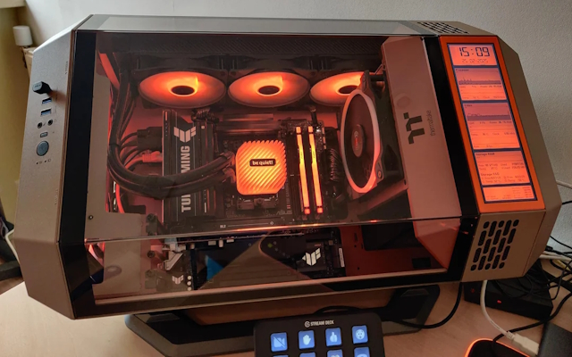
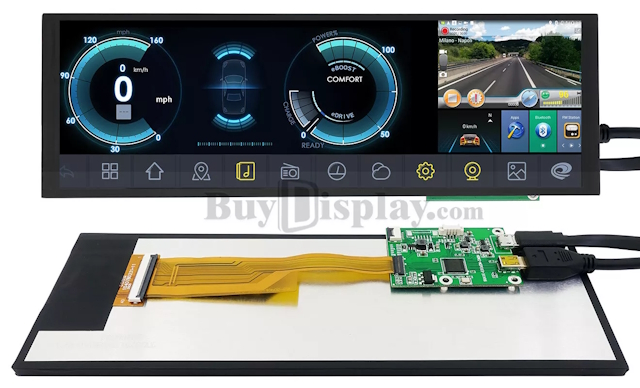
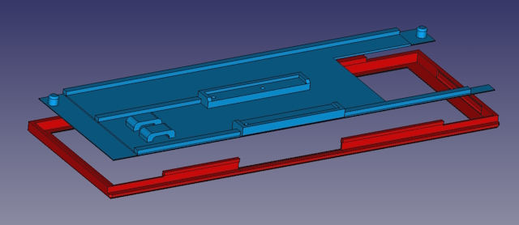
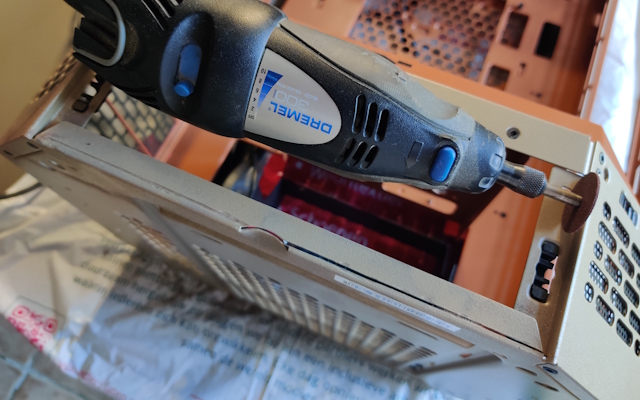

# ThermalTake Tower 300 LCD Stuff
Here's some miscellaneous stuff for the ThermalTake Tower 300 PC Case. The lower cover, where a ThermalTake 3.9" can be placed, is replaced by a 7.84" LCD with mini HDMI interface. The HDMI cable can be connected as a secondary/tertiary/any display within Windows. You can run any tools or screen add-on on this display. In this example AIDA64 Extreme is used to display a Sensor Panel. This repository contains the information needed to create your own display.

### The Display
The display used is a 7.84" 1280x400 pixels display from WaveShare. Bought from eBay, seller "BuyDisplay", but they're also available on Amazon and many other webshops. Just make sure its the 7.84" display and not the 8" display, the latter will not fit in the opening of the cover. Be careful with the FPC-cable, it's very fragile and any folding or scratching can cause permanent damage.

### The Frame
The frame is designed as two seperate parts, one is the front bezel and visible, the other part is a backpanel that fits the two holes and fixes the small PCB. It also provides two mounting point to fix the USB and Micr-HDMI cable to prevent the connectors ripping of the PCB.

### Case Modification
To fit the display pretty flush with the sides, you need to grind away the lower standing edge of the case. You can do this with a small grinder tool like a Dremel. Leave about 1 millimeter of the standing edge. After cutting, you also need to flatten the recess in the middle a little bit. Depending on the thickness of the connection on the LCD, you might also bend the left edge on the lower part of the metal. Keep the hole in place, it's needed for the frame.

